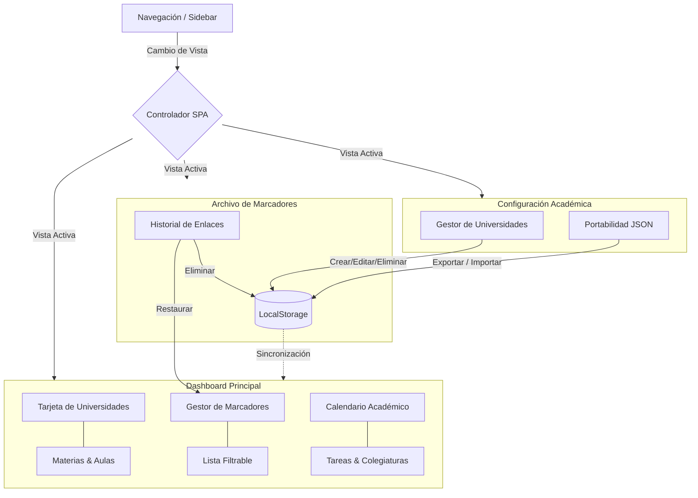

# Student Hub - Portal Central

Un dashboard académico e integrador de recursos diseñado como una Single Page Application (SPA) para la gestión organizada de actividades de estudio, portales universitarios y marcadores.

---

## Características principales

* **Gestión Académica**: Visualización dinámica de universidades, carreras y accesos directos a aulas virtuales.
* **Marcadores Recientes**: Clasificación, filtrado por tipo (PDF, Video, Curso, Sitio) y búsqueda rápida de enlaces de interés.
* **Calendario Dinámico**: Control de fechas clave, agendamiento de entregas académicas y seguimiento del vencimiento de la colegiatura.
* **Portabilidad de Datos**: Herramientas para importar y exportar la configuración completa en formato JSON.
* **Interfaz Adaptable**: Soporte para temas claro/oscuro y diseño optimizado para pantallas móviles y de escritorio.

---

## Estructura del Dashboard

El siguiente diagrama explica el flujo de datos, la navegación y las vistas integradas dentro de la SPA:

---

## Tecnologías utilizadas

* **HTML5** y **Tailwind CSS** (para la maquetación y estilos interactivos adaptables).
* **JavaScript (Vanilla)** (para la lógica SPA, manipulación del DOM y procesamiento del calendario).
* **FontAwesome Icons** (para el soporte gráfico iconográfico).
* **LocalStorage** (para la persistencia local de los datos del usuario).

## Licencia

Este proyecto está licenciado bajo la Licencia MIT. Para más detalles consulta el archivo [LICENSE](LICENSE).

## Autor

Proyecto desarrollado por **Rosendo Camal**.

Contacto:
* [`GitHub`](https://github.com/rosendocamal)
* [`Linkedin`](https://www.linkedin.com/in/rosendocamal)
